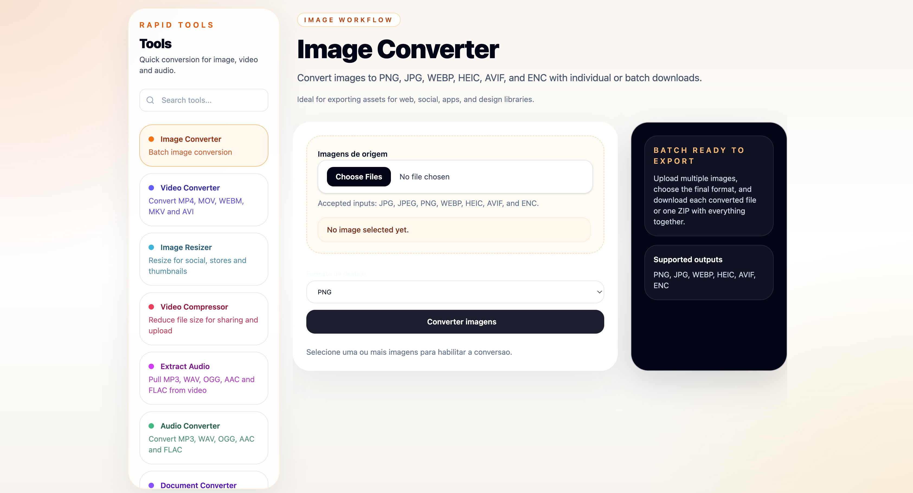

# RapidTools

RapidTools is a Phoenix LiveView app for batch media workflows including conversion, resizing, compression, PDF exports, individual downloads, and ZIP bundles.

## Preview



## Available tools

- Image converter at `/`
- Image resizer at `/image-resizer`
- Video converter at `/video-converter`
- Extract audio at `/extract-audio`
- Video compressor at `/video-compressor`
- Audio converter at `/audio-converter`
- PDF converter at `/pdf-converter`
- Together audios at `/together-audios`

## Supported formats

### Image output

- `PNG`
- `JPG`
- `WEBP`
- `HEIC`
- `AVIF`

### Image resizing output

- `Original format`
- `JPG`
- `PNG`
- `WEBP`

### Video output

- `MP4`
- `MOV`
- `WEBM`
- `MKV`
- `AVI`

### Video compression output

- `MP4`

### Audio output

- `MP3`
- `WAV`
- `OGG`
- `AAC`
- `FLAC`

### Audio extraction input/output

- Input: `MP4`, `MOV`, `WEBM`, `MKV`, `AVI`, `TS`
- Output: `MP3`, `WAV`, `OGG`, `AAC`, `FLAC`

### PDF workflows

- `PDF -> PNG`
- `PDF -> JPG`
- `JPG/PNG/WEBP -> PDF`

## Features

- Batch upload and conversion per tool
- Batch audio extraction from uploaded videos
- Batch image resizing with presets for social, thumbnails, and stores
- Batch video compression with quality and resolution presets
- PDF page extraction and image-to-PDF generation
- Audio joining into a single downloadable file
- Individual file download after conversion
- ZIP package download for converted batches
- Phoenix LiveView interface with dedicated screens for image, video, audio, extraction, PDF, and assembly workflows

## Requirements

- Elixir and Erlang compatible with the versions in `mix.exs`
- `ffmpeg` installed locally for audio and video conversion
- ImageMagick installed locally as `magick` or `convert` for image conversion

## Development

```bash
mix setup
mix phx.server
```

Open [http://localhost:4000](http://localhost:4000).

If port `4000` is already in use, you can start the app on the next available port:

```bash
sh dev-server.sh
```

You can also pick a different starting point:

```bash
PORT=4010 sh dev-server.sh
```

If you change any file under `config/`, restart the server instead of relying on code reloading.

## Test

```bash
mix precommit
```

For focused iteration:

```bash
mix test test/rapid_tools/audio_converter_test.exs
mix test test/rapid_tools_web/live/audio_converter_live_test.exs
mix test test/rapid_tools/audio_extractor_test.exs
mix test test/rapid_tools_web/live/extract_audio_live_test.exs
mix test test/rapid_tools/image_resizer_test.exs
mix test test/rapid_tools_web/live/image_resizer_live_test.exs
mix test test/rapid_tools/video_compressor_test.exs
mix test test/rapid_tools_web/live/video_compressor_live_test.exs
mix test test/rapid_tools/pdf_converter_test.exs
mix test test/rapid_tools_web/live/pdf_converter_live_test.exs
mix test test/rapid_tools/audio_joiner_test.exs
mix test test/rapid_tools_web/live/together_audios_live_test.exs
```
